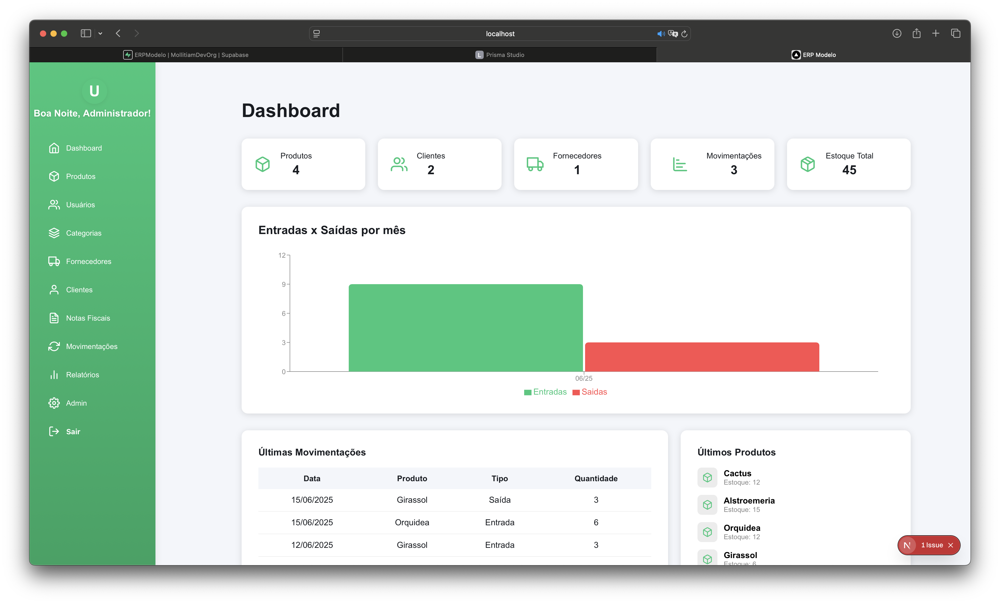
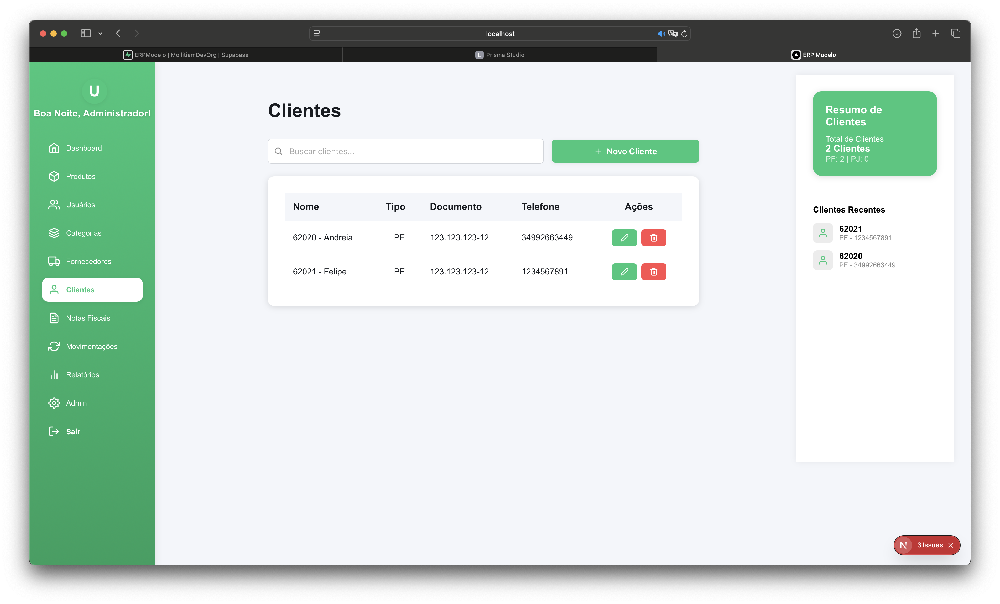
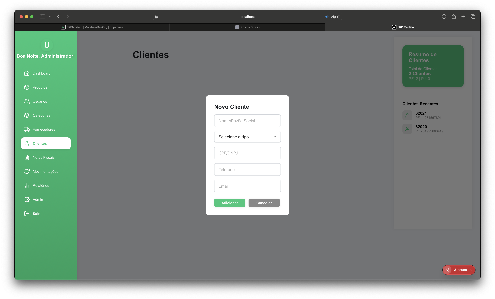
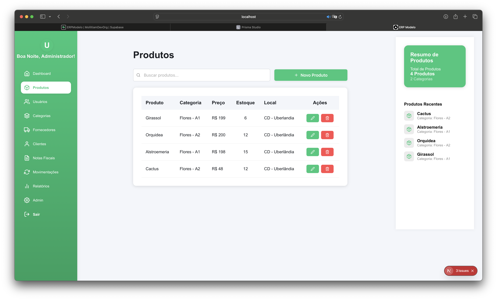
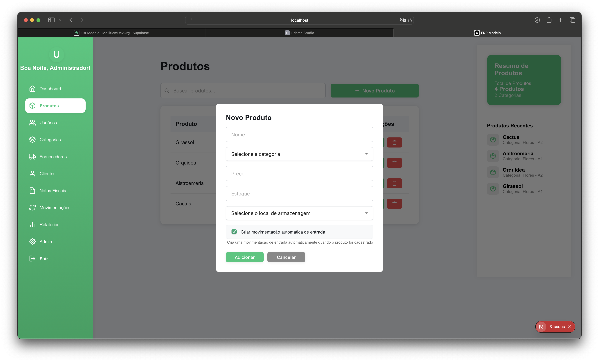
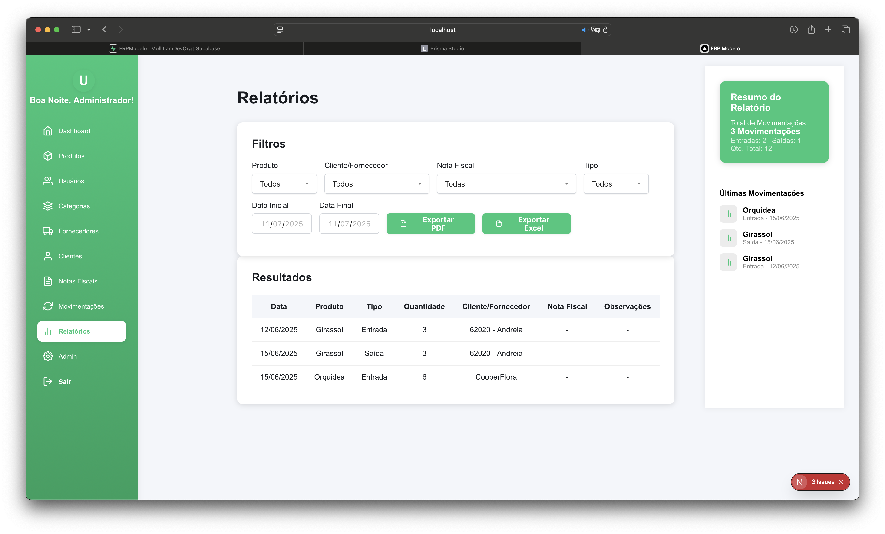

# ERP Modelo – Demonstração

🚫 **Este repositório é demonstrativo. O uso, cópia ou redistribuição sem autorização explícita é proibido.**  
© Mollitiam Development.

## Sobre o Sistema

O **ERP Modelo** é um template base para sistemas de gestão empresarial (ERP), pronto para ser customizado para diferentes clientes e segmentos.  
Permite controle de vendas, estoque, clientes, fornecedores, relatórios e muito mais, com arquitetura moderna e personalizável.

## Funcionalidades Principais

- Cadastro e gestão de clientes e fornecedores
- Controle de estoque e produtos
- Emissão de pedidos e relatórios gerenciais
- Estrutura modular e personalizável
- Interface responsiva e fácil de adaptar
- Scripts prontos para deploy e customização

## Technical Overview

- **Frontend:** Next.js (React), HTML5, CSS3
- **Backend:** Node.js, Prisma ORM
- **Banco de Dados:** Compatível com PostgreSQL, MySQL, SQLite (via Prisma)
- **Arquitetura:** Modular, separação clara de componentes, páginas e estilos
- **Deploy:** Scripts para desenvolvimento e produção
- **Personalização:** Fácil troca de logo, cores, textos e módulos

## 📁 Estrutura do Projeto

- `src/app/` — Páginas e layout principal
- `src/components/` — Componentes reutilizáveis
- `src/styles/` — Arquivos de estilo (CSS)
- `prisma/` — Migrations e schema do banco
- `public/` — Imagens, favicon, logo

## 📱 Screenshots

### 1. Tela Inicial

### 2. Cadastro de Clientes

### 3. Controle de Estoque

### 4. Relatórios

---

## Contato

Para mais informações, entre em contato:  
https://mollitiamdevelopment.great-site.net 
